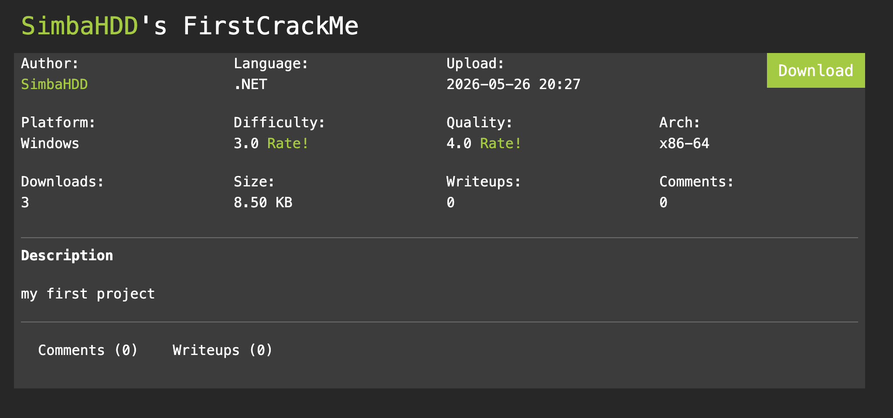
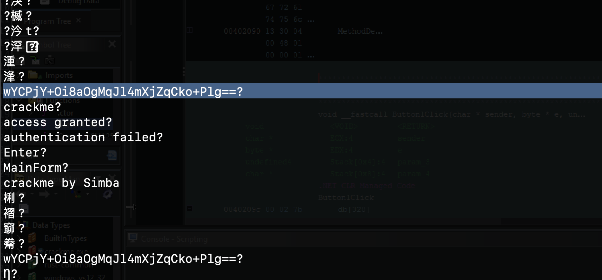
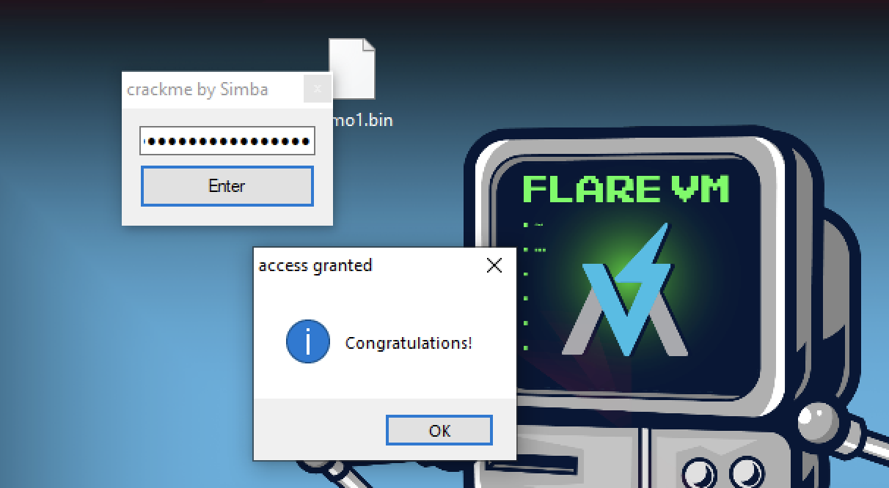

# FirstCrackMe

---



---

Crackme: [https://crackmes.one/crackme/6a160248d7ff92e1214c01ed](https://crackmes.one/crackme/6a160248d7ff92e1214c01ed)

---

### **1. Initial Analysis & Bypassing the String Obfuscation**

When running a standard `strings` command on `crackme.exe`, the encrypted password string `wYCPjY+Oi8aOgMqJl4mXjZqCko+Plg==` does not appear.

This happens because **.NET applications store user strings in UTF-16 LE format** (where each ASCII character is padded with a null byte `0x00`). Standard `strings` utilities scan for 8-bit ASCII characters by default and ignore these patterns.

### **The Fix**

To correctly extract the hidden strings, we convert the binary to UTF-8 on the fly before scanning:

```bash
iconv-c-f UTF-16LE-t UTF-8 crackme.exe| strings
```

This reveals the core constants:

- `wYCPjY+Oi8aOgMqJl4mXjZqCko+Plg==` (The encrypted password constant)
- `"crackme"` (The fallback check string)
- `"access granted"` & `"authentication failed"` (Status messages)



---

### **2. Decompiled Program Logic**

By decompiling the main action event `Button1Click` and the helper functions from the MSIL bytecode, we reconstruct the exact validation logic:

```bash
private void Button1Click(object sender, EventArgs e)
{
    string text = textBox1.Text; // User Input
    
    // Decrypt the stored password using single-byte XOR key 90 (0x5A)
    string decrypted = DecryptPassword("wYCPjY+Oi8aOgMqJl4mXjZqCko+Plg==", 90);
    
    // Cryptographic Hash & Encode checks
    string hash1 = ComputeSHA256(text);
    string hash2 = ComputeSHA256(decrypted);
    string enc_text = XOREncrypt(text, 90);
    string enc_decrypted = XOREncrypt(decrypted, 90);
    string b64_text = Convert.ToBase64String(Encoding.UTF8.GetBytes(text));
    string b64_decrypted = Convert.ToBase64String(Encoding.UTF8.GetBytes(decrypted));

    bool flag = false;
    
    // CHECKS 1-3 (These are impossible to satisfy)
    if (hash1 == hash2 || enc_text == enc_decrypted || b64_text == b64_decrypted)
    {
        flag = true;
    }
    // CHECK 4: The Fallback Solver Path
    else if (text.Length == decrypted.Length && text.Contains("crackme"))
    {
        flag = true;
    }

    if (flag) {
        MessageBox.Show("Congratulations!", "access granted");
    } else {
        MessageBox.Show("Access Denied", "authentication failed");
    }
}
```

### **Why Checks 1 to 3 are Impossible:**

When `DecryptPassword` decodes the Base64 string `wYCPjY+Oi8aOgMqJl4mXjZqCko+Plg==` and XORs it with `0x5A`, it yields the raw bytes: `0x9B, 0xDA, 0xD5, 0xD7, 0xD5, 0xD4, 0xD1, 0x9C, 0xD4, 0xDA, 0x90, ...`

In `.NET`, converting these invalid bytes back to a string using `Encoding.UTF8.GetString` triggers a lossy fallback replacement, substituting invalid byte structures with the Unicode replacement character `` (U+FFFD). Because this string corruption is lossy, typing a matching input to pass the cryptographic comparisons (Checks 1–3) is impossible.

We must satisfy **Check 4 (the fallback check)** instead.

### **3. Disassembly Analysis (MSIL Bytecode Mapping)**

From the Ghidra disassembly of `Button1Click` starting at address `0040209c`, here is how the instructions process the checks:

### **Fetching the Input & Stored Password:**

- **`[0]` to `[10]`** (`02 7b 04 00 00 04 6f 10 00 00 0a 0a`): Loads `textBox1.Text` and stores it into local variable `0` (`text`).
- **`[12]` to `[26]`** (`02 72 01 00 00 70 1f 5a 28 03 00 00 06 0b`): Loads the Base64 string from string token table (`70000001`), loads key `90` (`0x5A`), calls `DecryptPassword`, and stores it in local variable `1` (`decrypted`).

### **Performing the Length Checks (Check 4):**

- **`[170]`** (`6h` / `ldloc.0`): Loads the input `text` onto the execution stack.
- **`[171]`** (`6f 15 00 00 0a` / `callvirt string.get_Length`): Calls `.Length` on your input.
- **`[176]`** (`7h` / `ldloc.1`): Loads the `decrypted` corrupted string.
- **`[177]`** (`6f 15 00 00 0a` / `callvirt string.get_Length`): Calls `.Length` on the decrypted string (which evaluates to **`20`**).
- **`[182]`** (`33h, 10h` / `bne.un.s +10h`):
    - If the length of the user input is not equal to `20`, **branch forward by 16 bytes** to skip setting the success flag and eventually print `Access Denied`.

### **Checking the Substring Content:**

- **`[184]` to `[192]`** (`06 72 43 00 00 70 6f 16 00 00 0a`): Loads your input, loads the word `"crackme"` (token `70000043`), and calls `string.Contains()`.
- **`[216]`** (`2d 36` / `brtrue.s +36h`): If any validation fails, branch forward by 54 bytes to fail. Otherwise, proceed to display `"Congratulations!"` (`D0 05 00 00 04` at index `[229]`).

---

### **4. The Solution**

To successfully solve the crackme:

1. The input must have a length of **exactly 20 characters**.
2. The input must contain the substring **`crackme`**.

Correct password:

```bash
crackmeAAAAAAAAAAAAA
```



---