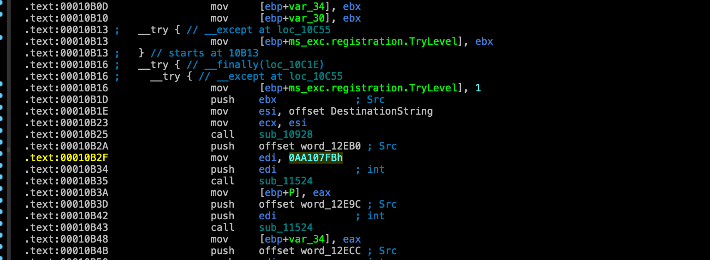
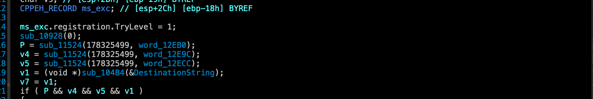
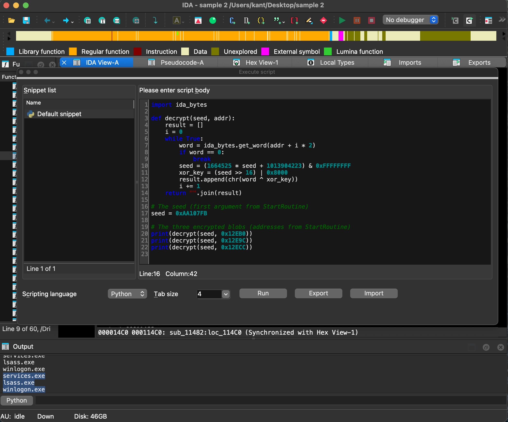
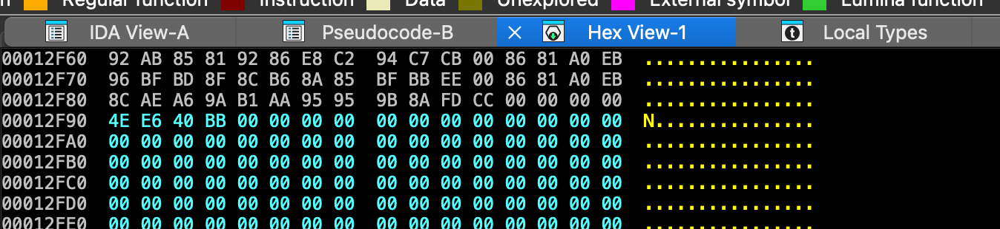
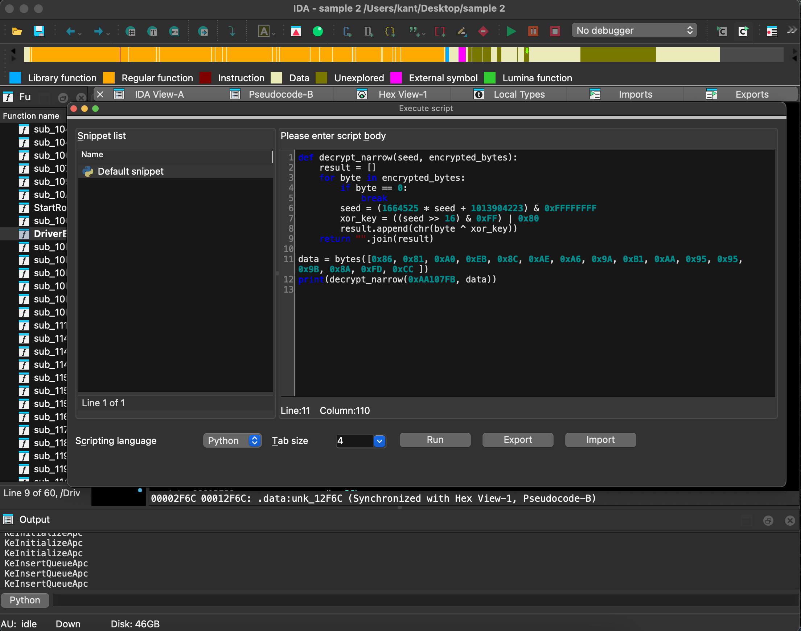

# EquationDrug

---

[https://malops.io/challenges/equationdrug](https://malops.io/challenges/equationdrug)

---

### Scenario

In late 2024, your SOC flags unusual outbound traffic from a senior engineer’s workstation custom TCP packets to an unknown server over non-standard ports. Investigation uncovers a modular, memory-only implant using kernel-level stealth. Identified as EquationDrug, it supports hidden plugin loading, encrypted C2 traffic, stealthy persistence, and targeted data exfiltration. Your challenge is to analyze sample and ask our questions to help us.

---

### Question 1

**What is the SHA256 of this sample?**

Answer:

```bash
kant@APPLEs-MacBook-Pro ~/Desktop> sha256sum sample\ 2 
980954a2440122da5840b31af7e032e8a25b0ce43e071ceb023cca21cedb2c43  sample 2
kant@APPLEs-MacBook-Pro ~/Desktop> 
```

---

### Question 2

**What type of executable is this sample?**

**Entry Point:** The binary contains a `DriverEntry` function (located at `0x10d14`), which is the standard entry point for Windows drivers.

Answer:

```bash
driver
```

---

### Question 3

**This sample attempts to masquerade as a component of the system. Which system component is it attempting to masquerade as?**

The sample attempts to masquerade as a legitimate **Windows NT SMB Manager** component to evade detection by system administrators and security tools.
**A. Metadata Forgery (Version Resource)** The malware includes a forged Version Information resource to blend in with legitimate Microsoft drivers:

- **File Description:** `Windows NT SMB Manager`
- **Company Name:** `Microsoft Corporation`
- **Original Filename:** `mrxsmbmg.sys`
- **Internal Project Name (PDB):** `mrxsmbmg.pdb`

```bash
.rsrc:0001356B                 db    0
.rsrc:0001356C                 db  57h ; W
.rsrc:0001356D                 db    0
.rsrc:0001356E                 db  69h ; i
.rsrc:0001356F                 db    0
.rsrc:00013570                 db  6Eh ; n
.rsrc:00013571                 db    0
.rsrc:00013572                 db  64h ; d
.rsrc:00013573                 db    0
.rsrc:00013574                 db  6Fh ; o
.rsrc:00013575                 db    0
.rsrc:00013576                 db  77h ; w
.rsrc:00013577                 db    0
.rsrc:00013578                 db  73h ; s
.rsrc:00013579                 db    0
.rsrc:0001357A                 db  20h
.rsrc:0001357B                 db    0
.rsrc:0001357C                 db  4Eh ; N
.rsrc:0001357D                 db    0
.rsrc:0001357E                 db  54h ; T
.rsrc:0001357F                 db    0
.rsrc:00013580                 db  20h
.rsrc:00013581                 db    0
.rsrc:00013582                 db  53h ; S
.rsrc:00013583                 db    0
.rsrc:00013584                 db  4Dh ; M
.rsrc:00013585                 db    0
.rsrc:00013586                 db  42h ; B
.rsrc:00013587                 db    0
.rsrc:00013588                 db  20h
.rsrc:00013589                 db    0
.rsrc:0001358A                 db  4Dh ; M
.rsrc:0001358B                 db    0
.rsrc:0001358C                 db  61h ; a
.rsrc:0001358D                 db    0
.rsrc:0001358E                 db  6Eh ; n
.rsrc:0001358F                 db    0
.rsrc:00013590                 db  61h ; a
.rsrc:00013591                 db    0
.rsrc:00013592                 db  67h ; g
.rsrc:00013593                 db    0
.rsrc:00013594                 db  65h ; e
.rsrc:00013595                 db    0
.rsrc:00013596                 db  72h ; r
.rsrc:00013597                 db    0
.rsrc:00013598                 db    0
```

Answer:

```bash
windows nt smb manager
```

---

### Question 4

**What is the Original Filename of the sample?**

The Original Filename is stored as a Unicode string.

**Navigating the .rsrc Segment**

```bash
.rsrc:000135F7                 db    0
.rsrc:000135F8                 db  6Dh ; m
.rsrc:000135F9                 db    0
.rsrc:000135FA                 db  72h ; r
.rsrc:000135FB                 db    0
.rsrc:000135FC                 db  78h ; x
.rsrc:000135FD                 db    0
.rsrc:000135FE                 db  73h ; s
.rsrc:000135FF                 db    0
.rsrc:00013600                 db  6Dh ; m
.rsrc:00013601                 db    0
.rsrc:00013602                 db  62h ; b
.rsrc:00013603                 db    0
.rsrc:00013604                 db  6Dh ; m
.rsrc:00013605                 db    0
.rsrc:00013606                 db  67h ; g
.rsrc:00013607                 db    0
.rsrc:00013608                 db  2Eh ; .
.rsrc:00013609                 db    0
.rsrc:0001360A                 db  73h ; s
.rsrc:0001360B                 db    0
.rsrc:0001360C                 db  79h ; y
.rsrc:0001360D                 db    0
.rsrc:0001360E                 db  73h ; s
.rsrc:0001360F                 db    0
```

Answer:

```bash
mrxsmbmg.sys
```

---

### Question 5

**This sample only runs on one type of system architecture, which one?**

Answer:

```bash
32-bit
```

---

### Question 6

**This is targeted at specific versions of the Windows operating system. Which version of Windows will this sample not run on?**

**DriverEntry Decompiled code.**

```bash
NTSTATUS __stdcall DriverEntry(PDRIVER_OBJECT DriverObject, PUNICODE_STRING RegistryPath)
{
  NTSTATUS result; // eax
  SIZE_T v3; // ebx
  PVOID Pool; // eax
  struct _OBJECT_ATTRIBUTES ObjectAttributes; // [esp+4h] [ebp-28h] BYREF
  struct _CLIENT_ID ClientId; // [esp+1Ch] [ebp-10h] BYREF
  ULONG MinorVersion; // [esp+24h] [ebp-8h] BYREF
  ULONG MajorVersion; // [esp+28h] [ebp-4h] BYREF

  PsGetVersion(&MajorVersion, &MinorVersion, 0, 0);
  if ( MajorVersion > 5 )   <-------- version checking................................
    return -1073741637;
  DriverObject->DriverUnload = (PDRIVER_UNLOAD)sub_10C6A;
  v3 = RegistryPath->Length + 2;
  Pool = ExAllocatePool(NonPagedPool, v3);
  dword_12FA0 = Pool;
  if ( !Pool )
    return -1073741670;
  memset(Pool, 0, v3);
  memcpy(dword_12FA0, RegistryPath->Buffer, RegistryPath->Length);
  RtlInitUnicodeString(&DestinationString, (PCWSTR)dword_12FA0);
  KeInitializeEvent(&Event, NotificationEvent, 1u);
  ObjectAttributes.Length = 24;
  memset(&ObjectAttributes.RootDirectory, 0, 20);
  result = PsCreateSystemThread(&ThreadHandle, 0x1F03FFu, &ObjectAttributes, 0, &ClientId, StartRoutine, 0);
  if ( result >= 0 )
    return 0;
  return result;
}
```

Answer:

```bash
6
```

---

### Question 7

**What Windows API does the sample use to execute the main function via Thread?**

From the `DriverEntry` decompilation we already analyzed, the answer is: **`PsCreateSystemThread`**

This is visible in `DriverEntry` at address `0x10DD7`:

```bash
result = PsCreateSystemThread(
    &ThreadHandle,       // Output: handle to the new thread
    0x1F03FF,            // Access mask (THREAD_ALL_ACCESS)
    &ObjectAttributes,   // Thread attributes
    0,                   // Process handle (0 = System process)
    &ClientId,           // Output: Client ID
    StartRoutine,        // ← The main malicious function
    0                    // Context parameter
);
```

**Answer:**

```bash
PsCreateSystemThread
```

---

### Question 8

**With the goal of obfuscating certain capabilities, the sample implements an algorithm for decrypting strings at runtime. What is the seed of this algorithm?**

**Step 1: Follow the Entry Point**

1. Go to **`DriverEntry`** (the starting function).
2. Press **F5** to decompile.
3. You see it creates a thread via `PsCreateSystemThread` → pointing to `StartRoutine`.
4. Double-click **`StartRoutine`** to follow the thread.

**Step 2: Spot the Decryption Pattern**

Inside `StartRoutine`, you see:

```
c
P=sub_11524(178325499,&unk_12EB0);
v4=sub_11524(178325499,&unk_12E9C);
v5=sub_11524(178325499,&unk_12ECC);
```

**🚩 Red Flag:** The same function is called multiple times with:

- The **same first argument** (a constant number) → this is the seed
- **Different second arguments** (pointers to data blobs) → these are encrypted strings

**Step 3: Dive into the Decryption Function**

Double-click `sub_11524` → it allocates memory, copies the blob, and calls `sub_11432`.

Double-click `sub_11432` → you see the core algorithm:

```c
for ( i=0; i< length;++i )
{
    a1=1664525* a1+1013904223;   // ← LCG formula
a2[i]^=HIWORD(a1)|0x8000;     // ← XOR decryption
}
```

**Now you know:**

- `a1` starts as the **seed** (`0xAA107FB`)
- Each iteration generates a new pseudo-random value
- That value is XORed with a character to decrypt it

**Step 4: Extract the Seed**

Go back to `StartRoutine` assembly (**press Tab** to switch from decompiler to disassembly):

```nasm
mov     edi, 0AA107FBh     ; ← The seed, loaded once
push    edi                 ; Reused for every decryption call
call    sub_11524
```

**The seed is `0xAA107FB`.**



Answer:

```bash
0xAA107FB
```

---

### Question 9

**What are the first three strings (in order) that were decrypted?**

Looking at the `StartRoutine` assembly, the first three decryption calls happen in this exact order:



**What Does This Function Do?"**

 **`sub_11524`:**

```c
v2 = 2 * wcslen(Src);                    // Get length of encrypted data
result = ExAllocatePool(NonPagedPool, v2 + 2);  // Allocate new buffer
memset(result, 0, v2 + 2);               // Zero it out
memcpy(v4, Src, v2);                      // Copy encrypted data into buffer
sub_11432(a1, v4);                        // ← DO SOMETHING to the copy
return v4;                                // Return the modified copy
```

**`sub_11432`:**

```c
for ( i = 0; i < length; ++i )
{
    a1 = 1664525 * a1 + 1013904223;
    a2[i] ^= HIWORD(a1) | 0x8000;
}
```

1. **`a1 = 1664525 * a1 + 1013904223`** → This generates a pseudo-random number from the previous one
2. **`HIWORD(a1) | 0x8000`** → Takes the upper 16 bits and sets the top bit
3. **`a2[i] ^= ...`** → XOR the encrypted character with that value

Now you have everything you need. Open IDA's **Python console (Shift + F2)** and write a small script:

```c
import ida_bytes

def decrypt(seed, addr):
    result = []
    i = 0
    while True:
        word = ida_bytes.get_word(addr + i * 2)
        if word == 0:
            break
        seed = (1664525 * seed + 1013904223) & 0xFFFFFFFF
        xor_key = (seed >> 16) | 0x8000
        result.append(chr(word ^ xor_key))
        i += 1
    return "".join(result)

# The seed (first argument from StartRoutine)
seed = 0xAA107FB

# The three encrypted blobs (addresses from StartRoutine)
print(decrypt(seed, 0x12EB0))
print(decrypt(seed, 0x12E9C))
print(decrypt(seed, 0x12ECC))
```



Answer:

```c
services.exe, lsass.exe, winlogon.exe
```

---

### Question 10

**This sample implements a process injection routine. What is the name of the injection technique implemented by this sample?**

The injection technique is: **APC Injection (Asynchronous Procedure Call Injection)**

**Evidence from Decrypted Strings**

The decrypted API names map directly to the APC injection workflow:

| **Step** | **Decrypted API** | **Purpose** |
| --- | --- | --- |
| 1 | `KeAttachProcess` | Attach to target process address space |
| 2 | `ZwAllocateVirtualMemory` | Allocate memory inside the target process |
| 3 | `KeDetachProcess` | Detach from target process |
| 4 | `KeInitializeApc` | Initialize an APC object pointing to the injected code |
| 5 | `KeInsertQueueApc` | Queue the APC to a thread in the target process |

How it works?

```c
1. Find target process (services.exe / lsass.exe / winlogon.exe)
       ↓
2. KeAttachProcess → Enter target's address space
       ↓
3. ZwAllocateVirtualMemory → Allocate a memory region
       ↓
4. Copy shellcode + LoadLibraryW path into allocated memory
       ↓
5. KeDetachProcess → Return to driver's context
       ↓
6. KeInitializeApc → Create an APC that points to the shellcode
       ↓
7. KeInsertQueueApc → Queue it to a thread in the target
       ↓
8. When the thread runs, the APC fires → shellcode executes
   → LoadLibraryW loads the malicious DLL (msvcp73.dll)
```

This is a **kernel-mode APC injection**, which is particularly dangerous because it operates from Ring 0 (kernel) and is very difficult to detect by user-mode security tools.

Answer:

```c
apc injection
```

---

### Question 11

**What are the two APIs used by this sample to execute the injection technique?**

**Step 1: Find the Encrypted Blob Address**

 `sub_11CCA` 

```c
int __stdcall sub_11CCA(int a1, int a2, int a3)
{
  const char *v3; // ebx
  const char *v4; // eax
  PVOID Pool; // eax
  const char *v7; // [esp+Ch] [ebp-4h]

  if ( !a1 || !a3 )
    return -1073741811;
  v3 = sub_11582(178325499, &unk_12F6C);
  v4 = sub_11582(178325499, &unk_12F7C);
  v7 = v4;
  if ( !v3 || !v4 )
    return -1073741823;
  Pool = ExAllocatePool(NonPagedPool, 0x30u);
  P = Pool;
  if ( !Pool )
    return -1073741670;
  ((void (__stdcall *)(PVOID, int, _DWORD, int (__stdcall *)(int, int, int, int, int), int (__stdcall *)(int), int, int, int))v3)(
    Pool,
    a3,
    0,
    sub_11CB2,
    nullsub_1,
    a1,
    1,
    a2);
  KeClearEvent(&Event);
  if ( !((unsigned __int8 (__stdcall *)(PVOID, _DWORD, _DWORD, _DWORD))v7)(P, 0, 0, 0) )
  {
    KeSetEvent(&Event, 0, 0);
    return -1073741823;
  }
  return 0;
}
```

```c
v3 = sub_11582(178325499, &unk_12F6C);
```

The `&unk_12F6C` is the **address** of the encrypted data. Double-click `unk_12F6C` in IDA to navigate there.

**Step 2: Read the Raw Bytes**

In the **Hex View**, at address `0x12F6C` you see:

```
86 81 A0 EB 96 BF BD 8F 8C B6 8A 85 BF BB EE 00
```

The `00` at the end is the null terminator (end of string). So the encrypted bytes are:

```
86, 81, A0, EB, 96, BF, BD, 8F, 8C, B6, 8A, 85, BF, BB, EE
```

That's **15 bytes = 15 characters** (since this is single-byte ASCII, not Unicode).



**Step 3: Know the Algorithm**

We already reverse-engineered `sub_11482` (the ASCII decryption function):

```
For each byte:
    seed = (seed × 0x19660D + 0x3C6EF35F) & 0xFFFFFFFF
    xor_key = third_byte_of(seed) | 0x80
    decrypted = encrypted_byte ^ xor_key
```

Where third_byte_of(seed) means: **(seed >> 16) & 0xFF**

**Step 4: Script**

```c
def decrypt_narrow(seed, encrypted_bytes):
    result = []
    for byte in encrypted_bytes:
        if byte == 0:
            break
        seed = (1664525 * seed + 1013904223) & 0xFFFFFFFF
        xor_key = ((seed >> 16) & 0xFF) | 0x80
        result.append(chr(byte ^ xor_key))
    return "".join(result)

data = bytes([0x86,0x81,0xA0,0xEB,0x96,0xBF,0xBD,0x8F,0x8C,0xB6,0x8A,0x85,0xBF,0xBB,0xEE])
print(decrypt_narrow(0xAA107FB, data))
# Output: KeInitializeApc
```

for the other one:

**Read the Bytes at `0x12F7C`** 



Answer:

```c
KeInitializeApc, KeInsertQueueApc
```

---

### Question 12

A shellcode will be injected using the technique identified in the previous question. This shellcode will load a module into the injected memory. What is the name of this module?

 **`StartRoutine`** 

```c
v1 = sub_104B4(&DestinationString);    // ← What does this return?
v7 = v1;
```

**Double-click `sub_104B4` to go inside**

You see two paths:

```c
// Path 1: Registry read succeeds
RtlInitUnicodeString(&ValueName, L"Excluded");    // ← A registry value name!
if (sub_11EA6(...)<0 )    // If registry read FAILS...
{
// Path 2: Fallback
    v11=sub_11524(178325499, word_12E84);    // ← Decrypts something!
return v11;
}
```

**Decrypt `word_12E84`**

**In Hex View:**

1. Double-click `word_12E84` → navigate to address `0x12E84`
2. Read the bytes: `20 B7 17 F6 1F A7 66 97 8F DD 7C 9A 67 B6 C0 B5 84 85 33 DC 1C F2 00 00`
3. Apply the LCG decryption (wide/Unicode) with seed `0xAA107FB`

```c
1. StartRoutine → see v7 = sub_104B4(...)
       ↓ double-click
2. sub_104B4 → see fallback: sub_11524(seed, word_12E84)
       ↓ go to Hex View at 0x12E84
3. Read bytes → Decrypt → "msvcp73.dll"
       ↓ go back to StartRoutine
4. See v7 passed to sub_1116E → sub_10FBC
       ↓ double-click
5. sub_10FBC → resolves LoadLibraryW, copies "msvcp73.dll"
       ↓
6. Conclusion: shellcode calls LoadLibraryW("msvcp73.dll")
```

```c
python3 -c "
seed = 0xAA107FB
data = bytes([0x20,0xb7,0x17,0xf6,0x1f,0xa7,0x66,0x97,0x8f,0xdd,0x7c,0x9a,0x67,0xb6,0xc0,0xb5,0x84,0x85,0x33,0xdc,0x1c,0xf2,0x00,0x00])
result = []
for i in range(0, len(data), 2):
    word = data[i] | (data[i+1] << 8)
    if word == 0: break
    seed = (1664525 * seed + 1013904223) & 0xFFFFFFFF
    result.append(chr(word ^ ((seed >> 16) | 0x8000)))
print('Module:', ''.join(result))
"
Module: msvcp73.dll
```

Answer:

```c
msvcp73.dll
```

---

---